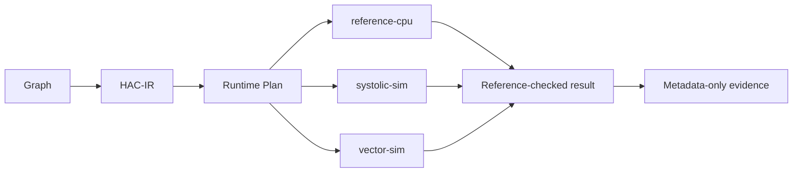

# Research Onboarding Slice

This is the shortest path from the TUC research claim to executable evidence.

TUC asks one question:

```text
Can compute intent flow through a hardware-independent interface into
capability-driven runtime planning and correct controlled execution?
```

The current proof shape is Objective Alpha:



## Run The First Proof

From the repository root:

```bash
python examples/proof_of_execution.py
python examples/runtime_evidence_matrix.py
python examples/runtime_evidence_gate.py
```

Emit the data-only onboarding evidence report:

```bash
python examples/research_onboarding_evidence.py
```

The first command executes the smallest proof that a neutral graph can be
planned and run through trusted prototype executors. The matrix inventories the
proof evidence. The gate checks that required evidence is present before the
proof can count as merge evidence.

## What This Proves

- Compute intent can be represented as hardware-neutral HAC-IR.
- Runtime planning can choose among capability-described prototype backends.
- Trusted in-process executors can produce deterministic results.
- Results can be checked against independent reference semantics.
- Evidence can be reviewed without serialized tensor values.

## What This Does Not Prove

- Native performance parity.
- A production CUDA, ROCm, XLA, TVM, IREE, Triton, or PyTorch replacement.
- Broad source-code parsing.
- Arbitrary third-party backend execution.
- Device access or generated-artifact execution.

## Where To Look Next

- Core research claim: `README.md`
- Strategic direction: `TUC_MASTER_PLAN.md`
- Operational state: `docs/ROADMAP_STATUS.md`
- Runtime execution: `docs/RUNTIME_EXECUTOR.md`
- Evidence flow: `docs/RUNTIME_EVIDENCE_FLOW.md`
- Frontend intake: `docs/SOURCE_TO_INTENT_RESEARCH_READINESS.md`
- Performance boundary: `docs/PERFORMANCE_PROOF_BOUNDARY.md`
- External review response: `docs/EXTERNAL_REVIEW_TRIAGE_2026_06_22.md`
- Onboarding evidence: `docs/RESEARCH_ONBOARDING_EVIDENCE.md`

## Contribution Lanes

Good first contributions should strengthen the proof without widening the
attack surface:

- improve documentation around an existing runnable proof;
- add negative fixtures for malformed source, manifest, IR, or evidence input;
- add a manifest-only backend example that passes claim review;
- improve deterministic diagnostics for a failing evidence gate.

Avoid adding broad parsers, plugin discovery, device access, subprocess
execution, or performance claims without a dedicated RFC and security review.
